# mermaid的使用

## mermaid 简介

## mermaid 使用

### mermaid 绘制流程图
	mermaid 通过使用 Graph 关键字来声明图形绘制的开始，通常还需要配合布局指令，
	布局指令如下:
		TB: 从上倒下
		BT: 从下倒上
		LR: 从左到右
		RL: 从右到左

======================================================================================

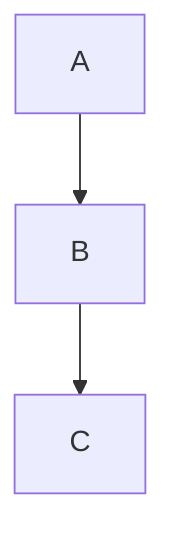

======================================================================================

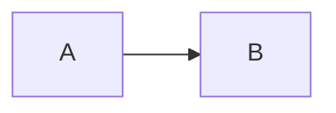

======================================================================================

### 形状
	节点的形状通常使用一些符号来表示，如下:

======================================================================================

	矩形：[]

======================================================================================

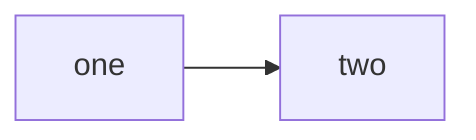

======================================================================================

	圆角矩形：()

======================================================================================

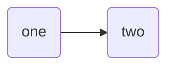

======================================================================================

	圆形：(())

======================================================================================

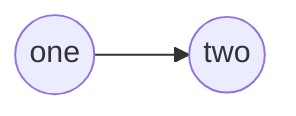

======================================================================================

	非对称形状：> ]

======================================================================================

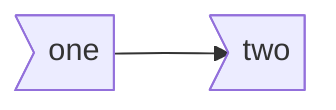

======================================================================================

	菱形：{}

======================================================================================

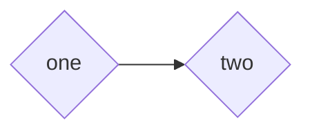

======================================================================================

	六角形: {{}}

======================================================================================

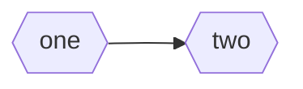

======================================================================================

	平行四边形：[//]

======================================================================================

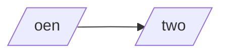

=====================================================================================

	反平行四边形：[\\]

=====================================================================================

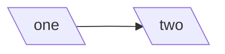

=====================================================================================

	梯形：[/\]

=====================================================================================

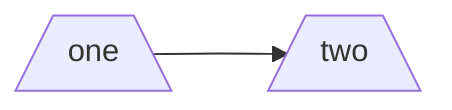

======================================================================================

	反梯形：[\/]

======================================================================================

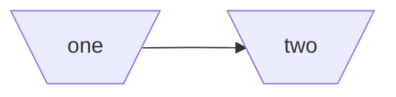

======================================================================================

### 链接
	节点之间的链接如下:

======================================================================================

	箭头链接：-->

======================================================================================

======================================================================================

	开链接：---

======================================================================================

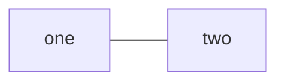

======================================================================================

	带有文本的链接：--This is a text ---

======================================================================================

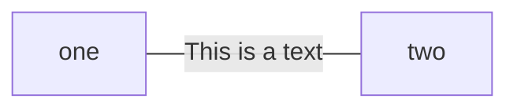

======================================================================================

	带有文本的箭头链接：-->|This is a text｜

======================================================================================

======================================================================================

	虚线链接 : -.->

======================================================================================

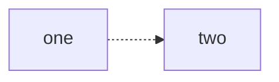

======================================================================================

	带有文本的虚线链接: -.This is a text .->

======================================================================================

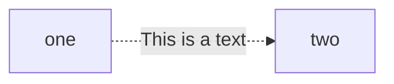

======================================================================================

	粗链接: ==>

======================================================================================

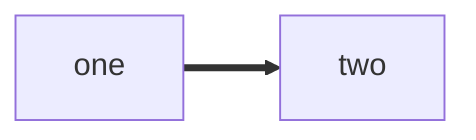

======================================================================================

	带有文本的粗链接：== This is a text ==>

======================================================================================

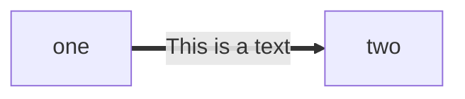

======================================================================================
