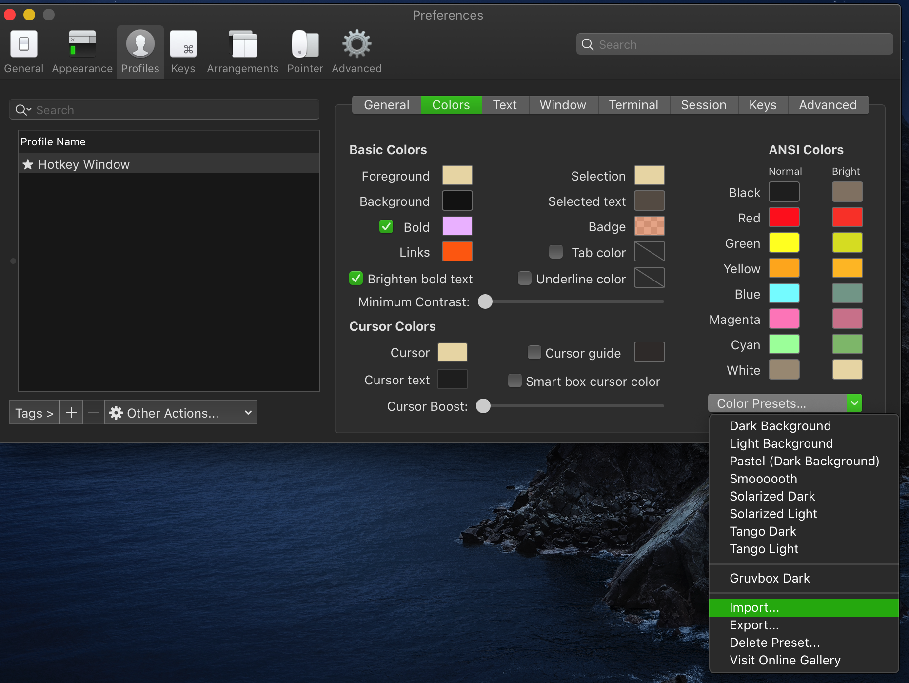
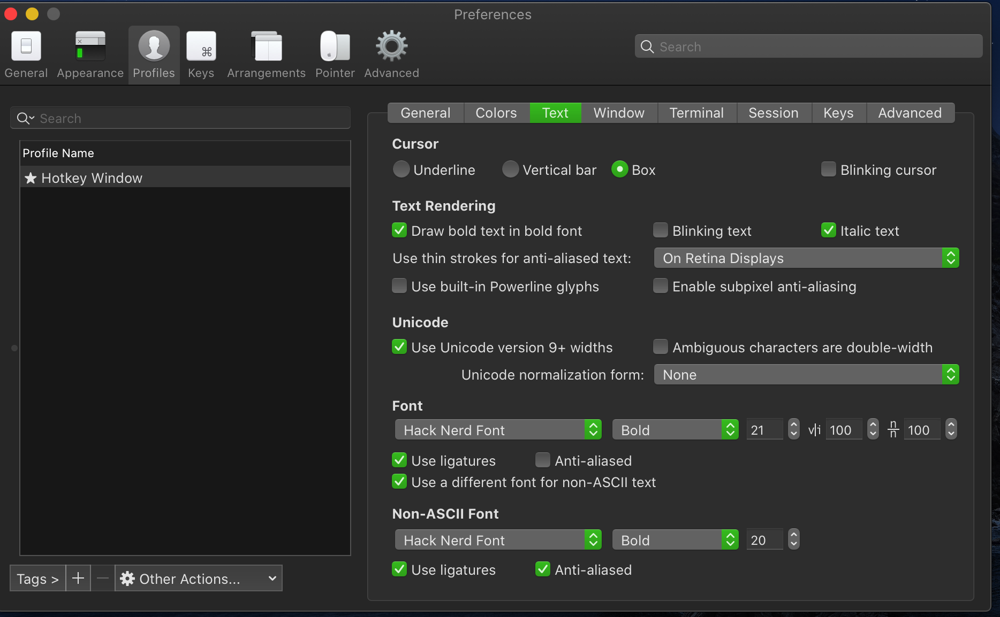
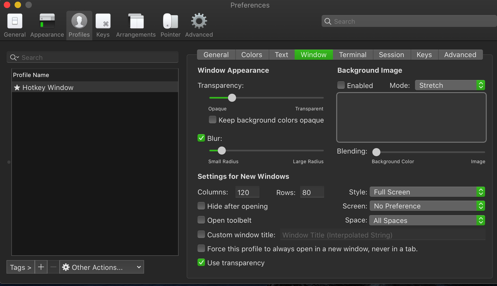
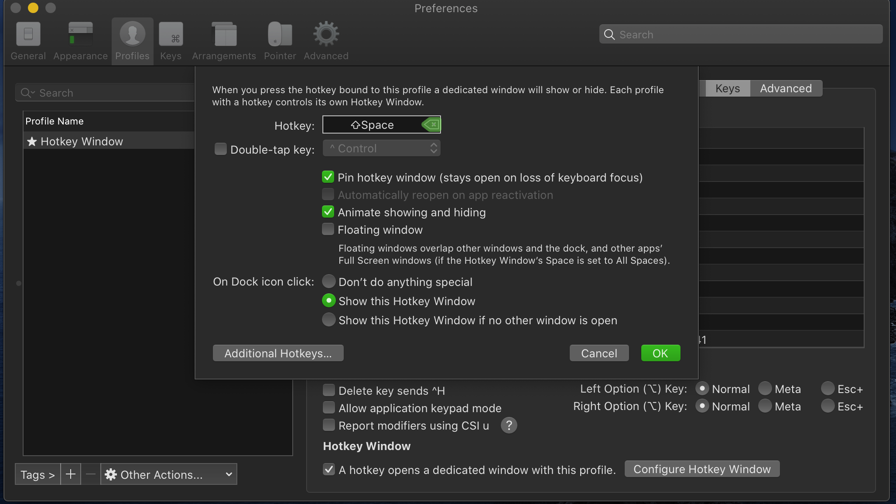

# item2使用

安装

```brew cask install intem2```

配置

需要配置终端主题: Profiles -> Colors -> 选择你喜欢的主题,
如果不喜欢默认的主题，也可以找其他的主题，下载到本地，然后 在面板的右下方，点击 input 选项导入下载的主题，然后在选择.


Profiles -> Text -> 选择你喜欢的字体



Profiles -> Window -> 可以调整终端透明度，以及背景模糊效果



Keys -> Hotkey ：设置热键


