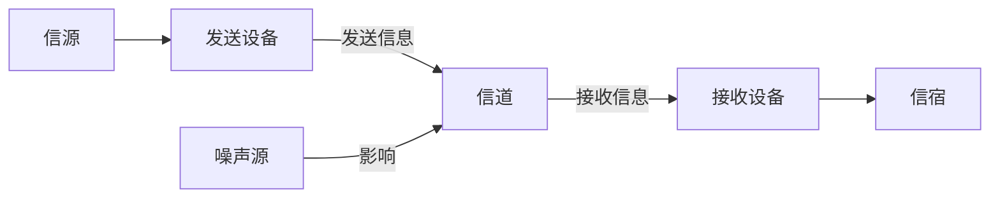
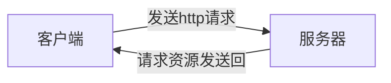
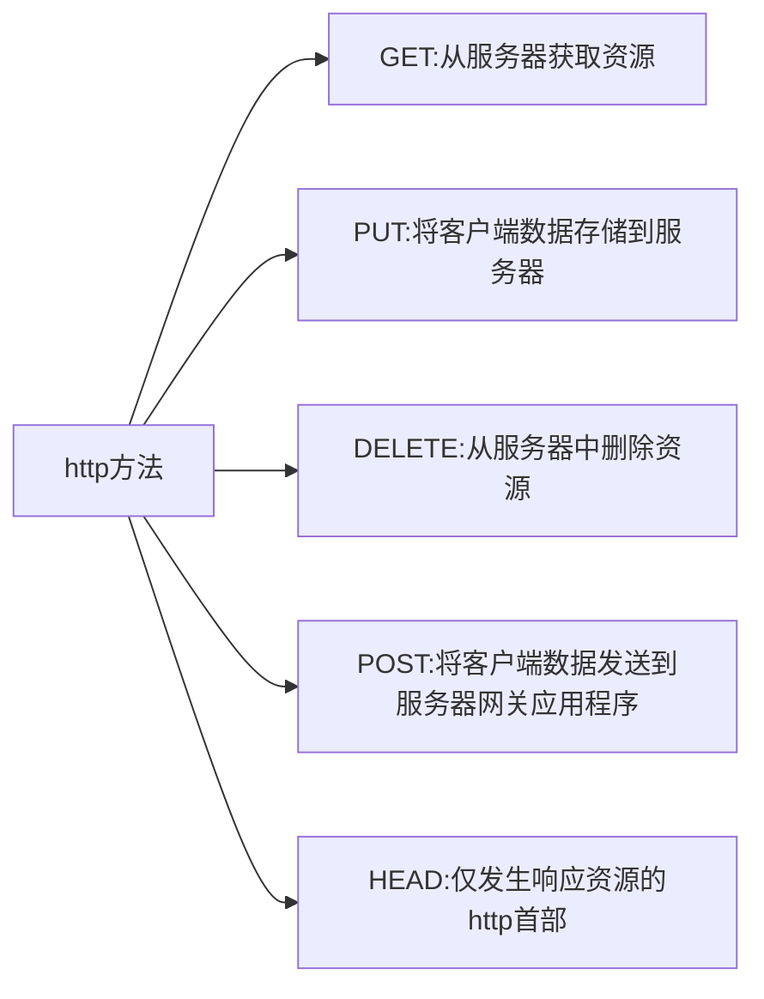
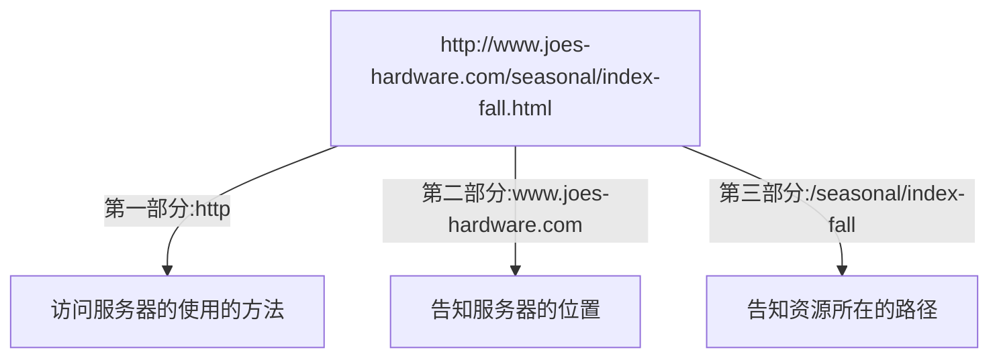
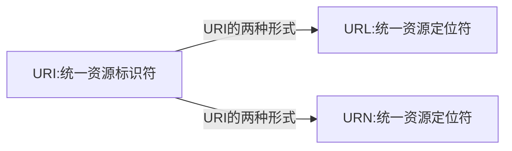

# 计算机网络
	
	计算机网络是通信技术与计算机技术紧密结合的产物

## 通信系统模型

=================================================================================

## 网络请求

	http事务是由一条请求指令和一个响应结果组成

	http方法

	URL的构成

=================================================================================

## URI:统一资源标识符

